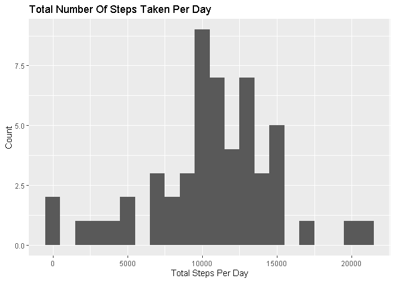
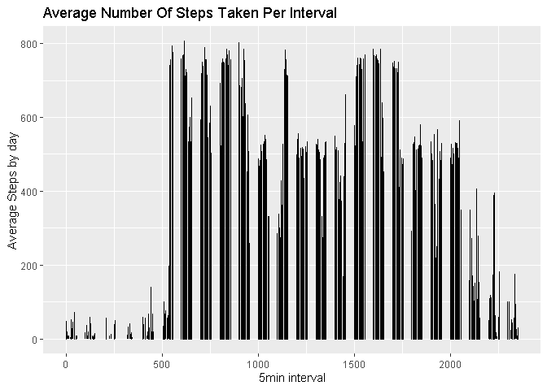
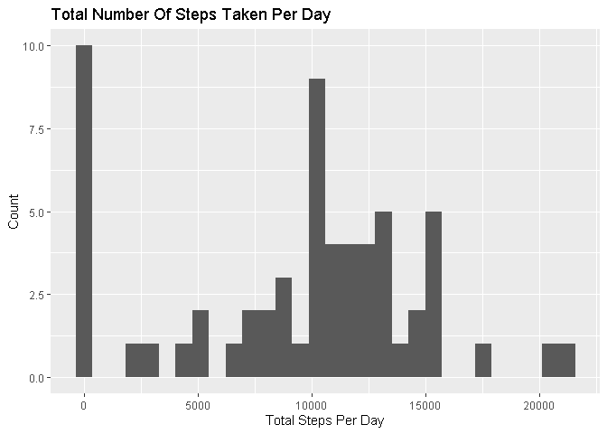
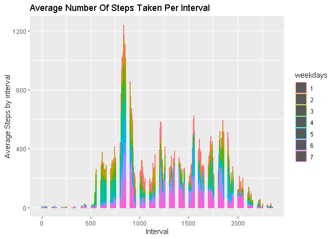

Title: "Project Week 1" Author: Amanda =============================================

This assignment will be described in multiple parts, with answers to the questions detailed.

1)  Dataset: Activity monitoring data [52K]

-   CSV file

2)  Variables included :

-   steps: Number of steps taking in a 5-minute interval (missing values are coded as NA)
-   date: The date on which the measurement was taken in YYYY-MM-DD format
-   interval: Identifier for the 5-minute interval in which measurement was taken

=============================================

Notes: - Needed: dplyr, tidyr, knitr, ggplot2 and lubridate package - Dataset available at <https://d396qusza40orc.cloudfront.net/repdata%2Fdata%2Factivity.zip>

# 1) Loading and preprocessing the data


```r
## Load needed packages
library(lubridate)
```

```
## Warning: package 'lubridate' was built under R version 4.1.3
```

```
## 
## Attaching package: 'lubridate'
```

```
## The following objects are masked from 'package:base':
## 
##     date, intersect, setdiff, union
```

```r
library(dplyr)
```

```
## Warning: package 'dplyr' was built under R version 4.1.3
```

```
## 
## Attaching package: 'dplyr'
```

```
## The following objects are masked from 'package:stats':
## 
##     filter, lag
```

```
## The following objects are masked from 'package:base':
## 
##     intersect, setdiff, setequal, union
```

```r
library(ggplot2)
library(tidyr)
library(knitr)
```


```r
## Set Directory
setwd("C:/Users/amand/Desktop/IBM/JH - data science/reproducible")

## Download File
url <- "https://d396qusza40orc.cloudfront.net/repdata%2Fdata%2Factivity.zip"
download.file(url, destfile = "Factivity.zip")

## Untar the file
untar("Factivity.zip")

## list.files() to find the name of the files
list.files()
```

```
##  [1] "activity.csv"                "Assignment.md"              
##  [3] "Assignment.rmd"              "Assignment_files"           
##  [5] "Factivity.zip"               "Final Programm.ipynb"       
##  [7] "PA1_template.Rmd"            "plot3.png"                  
##  [9] "plot4.png"                   "Week-1---Reproducible.html" 
## [11] "Week 1 - Reproducible.ipynb"
```


```r
## Read CSV and create data frame
df <- read.csv(file = "activity.csv", header = T, na.strings = "NA")

## Preview the dataframe
str(df)
```

```
## 'data.frame':	17568 obs. of  3 variables:
##  $ steps   : int  NA NA NA NA NA NA NA NA NA NA ...
##  $ date    : chr  "2012-10-01" "2012-10-01" "2012-10-01" "2012-10-01" ...
##  $ interval: int  0 5 10 15 20 25 30 35 40 45 ...
```


```r
## Date vairable is a "character" in Y-M-D, convert to "date"

df$date <- parse_date_time(df$date, orders = "Ymd")

# Check transformation

str(df)
```

```
## 'data.frame':	17568 obs. of  3 variables:
##  $ steps   : int  NA NA NA NA NA NA NA NA NA NA ...
##  $ date    : POSIXct, format: "2012-10-01" "2012-10-01" ...
##  $ interval: int  0 5 10 15 20 25 30 35 40 45 ...
```

# 2) What is mean total number of steps taken per day?

Ignore the missing values in the dataset.

1.  Calculate the total number of steps taken per day

2.  Make a histogram of the total number of steps taken each day

3.  Calculate and report the mean and median of the total number of steps taken per day


```r
## 2.1 Total number of steps taken per day

sum(df$steps, na.rm = TRUE) #ignore NA
```

```
## [1] 570608
```


```r
## 2.2 Histogram of the total number of steps taken per day
# Group DF by date and creat a total steps column
total_steps <- df %>%
                group_by(date) %>%
                    summarise(totalsteps = sum(steps))
# Check table
head(total_steps)
```

```
## # A tibble: 6 x 2
##   date                totalsteps
##   <dttm>                   <int>
## 1 2012-10-01 00:00:00         NA
## 2 2012-10-02 00:00:00        126
## 3 2012-10-03 00:00:00      11352
## 4 2012-10-04 00:00:00      12116
## 5 2012-10-05 00:00:00      13294
## 6 2012-10-06 00:00:00      15420
```


```r
# Plot the histogram

ggplot(total_steps, aes(x = totalsteps)) +
     geom_histogram(binwidth = 1000) +
     ggtitle("Total Number Of Steps Taken Per Day") +
     labs(y = "Count",
          x = "Total Steps Per Day")
```

```
## Warning: Removed 8 rows containing non-finite values (stat_bin).
```

<!-- -->


```r
## 2.3 Mean and median of the total number of steps taken per day

mean(total_steps$totalsteps, na.rm = TRUE) #ignore NA
```

```
## [1] 10766.19
```

```r
median(total_steps$totalsteps, na.rm = TRUE)
```

```
## [1] 10765
```

# 3) What is the average daily activity pattern?

1)  Make a time series plot of the 5-minute interval (x-axis) and the average number of steps taken, averaged across all days (y-axis)

2)  Which 5-minute interval, on average across all the days in the dataset, contains the maximum number of steps?


```r
## 3.1 Time Series Plot: 5min interval x AVG steps by day

# Group DF by date and interval; create an *average steps* column
avg_steps <- df %>%
                group_by(date, interval) %>%
                    summarise(average_steps = mean(steps, na.rm = FALSE))
```

```
## `summarise()` has grouped output by 'date'. You can override using the
## `.groups` argument.
```

```r
# Check table
head(avg_steps)
```

```
## # A tibble: 6 x 3
## # Groups:   date [1]
##   date                interval average_steps
##   <dttm>                 <int>         <dbl>
## 1 2012-10-01 00:00:00        0            NA
## 2 2012-10-01 00:00:00        5            NA
## 3 2012-10-01 00:00:00       10            NA
## 4 2012-10-01 00:00:00       15            NA
## 5 2012-10-01 00:00:00       20            NA
## 6 2012-10-01 00:00:00       25            NA
```


```r
# Plot the Time Series Plot

ggplot(avg_steps, aes(x = avg_steps$interval, y = average_steps)) +
  geom_line() +
  ggtitle("Average Number Of Steps Taken Per Interval") +
  labs(y = "Average Steps by day",
       x = "5min interval")
```

```
## Warning: Removed 2 row(s) containing missing values (geom_path).
```

<!-- -->


```r
# 3.2 Which 5-minute interval, on average across all the days in the dataset, contains the maximum number of steps?

head(arrange(avg_steps, desc(average_steps)), n = 1)
```

```
## # A tibble: 1 x 3
## # Groups:   date [1]
##   date                interval average_steps
##   <dttm>                 <int>         <dbl>
## 1 2012-11-27 00:00:00      615           806
```

# 4) Imputing missing values

1.  Calculate total number of rows with NAs in the dataset.

2.  Devise a strategy for filling in all of the missing values in the dataset.

3.  Create a new dataset with the missing data filled in.

4.  Make a histogram of the total number of steps taken each day

5.  Calculate a the mean and median total number of steps taken per day.

-   Do these values differ from the first estimates?
-   What is the impact of imputing this missing data?


```r
## 4.1 Total number of rows with NAs
summary(df)
```

```
##      steps             date               interval     
##  Min.   :  0.00   Min.   :2012-10-01   Min.   :   0.0  
##  1st Qu.:  0.00   1st Qu.:2012-10-16   1st Qu.: 588.8  
##  Median :  0.00   Median :2012-10-31   Median :1177.5  
##  Mean   : 37.38   Mean   :2012-10-31   Mean   :1177.5  
##  3rd Qu.: 12.00   3rd Qu.:2012-11-15   3rd Qu.:1766.2  
##  Max.   :806.00   Max.   :2012-11-30   Max.   :2355.0  
##  NA's   :2304
```

```r
# 2304 NA's on the STEPS variable
```


```r
## 4.2 Fill the NAs
# NA replaced by the value 0, to mean 0 steps taken in that interval
## 4.3 New DataSet with the NAs as 0

new_df <- df
new_df$steps <- new_df$steps %>% replace_na(0)

## 4.4 Histogram
# Group DF by date and create a total steps column
new_total_steps <- new_df %>%
                    group_by(date) %>%
                        summarise(totalsteps = sum(steps))
# Check table
head(new_total_steps)
```

```
## # A tibble: 6 x 2
##   date                totalsteps
##   <dttm>                   <int>
## 1 2012-10-01 00:00:00          0
## 2 2012-10-02 00:00:00        126
## 3 2012-10-03 00:00:00      11352
## 4 2012-10-04 00:00:00      12116
## 5 2012-10-05 00:00:00      13294
## 6 2012-10-06 00:00:00      15420
```


```r
# 4.4 Plot the histogram

ggplot(new_total_steps, aes(x = totalsteps)) +
     geom_histogram() +
     ggtitle("Total Number Of Steps Taken Per Day") +
     labs(y = "Count",
          x = "Total Steps Per Day")
```

```
## `stat_bin()` using `bins = 30`. Pick better value with `binwidth`.
```

<!-- -->


```r
## 4.5 Mean and median of the NEW total number of steps taken per day

mean(new_total_steps$totalsteps)
```

```
## [1] 9354.23
```

```r
median(new_total_steps$totalsteps)
```

```
## [1] 10395
```

```r
## Do these values differ from the first estimates?
# Yes, they�re both smaller than the original mean and median
## What is the impact of imputing this missing data?
# It changes the first estimated value; ignoring NA�s may affect results.
```

# 5) Are there differences in activity patterns between weekdays and weekends?

Use the dataset with the filled-in missing values for this part.

1)  Create a new factor variable in the dataset with two levels � �weekday� and �weekend�

2)  Make a panel plot containing a time series plot of the 5-minute interval (x-axis) and the average number of steps taken, averaged across all weekday days or weekend days (y-axis).


```r
## 5.1 New factor variable with two levels � �weekday� and �weekend"
# wday = dates to weekday; 1 = sunday, 2 = monday, ..., 7 = saturday

new_df2 <- df
new_df2$steps <- new_df2$steps %>% replace_na(0) # replacing the NAs for 0 
new_df2$weekdays <- factor(wday(new_df2$date))   # placing the weekdays numbers
```


```r
# 5.2 Plot the Time Series Plot

ggplot(new_df2, aes(x = interval, y = steps)) +
geom_histogram((aes(group = weekdays, color = weekdays)), stat = "summary", fun = "mean") +
  ggtitle("Average Number Of Steps Taken Per Interval") +
  labs(y = "Average Steps by interval",
       x = "Interval")
```

```
## Warning: Ignoring unknown parameters: binwidth, bins, pad
```

<!-- -->
